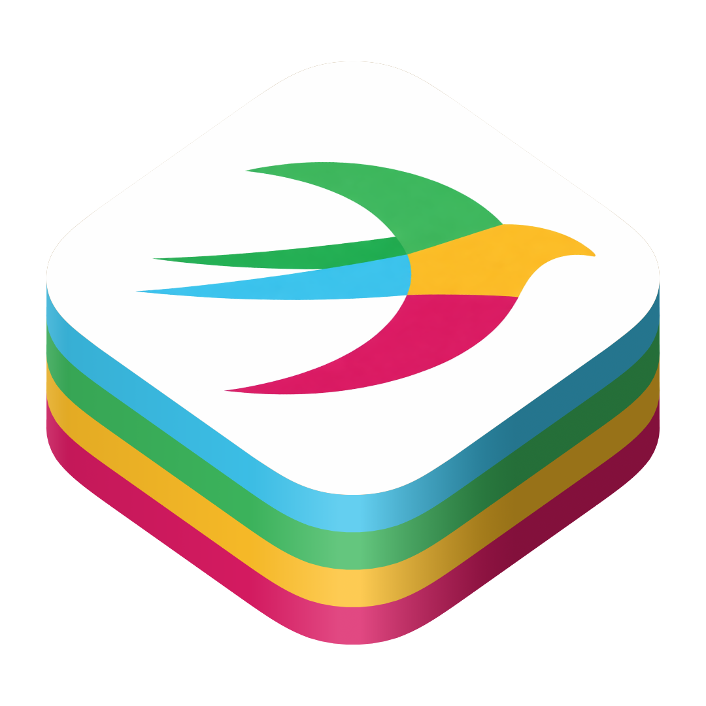

# SlackKit

<p align="center">
    
</p>

<p align="center">
    <a href="https://github.com/diegotl/SlackKit/actions/workflows/ci.yml">
        
    </a>
    <a href="https://github.com/diegotl/SlackKit/releases">
        
    </a>
    <a href="LICENSE">
        
    </a>
    
    
    
</p>

[Swift](https://swift.org) package for sending messages to [Slack](https://slack.com) via Incoming Webhooks with full support for [Block Kit](https://api.slack.com/block-kit).

## Features

- **Modern Swift API** - Built with Swift 6, async/await, and strict concurrency
- **Type-Safe** - Full Codable support with compile-time safety
- **Block Kit** - Complete support for Slack's Block Kit API
- **Flexible** - Send simple text messages or rich interactive messages

## Requirements

- macOS 12.0+
- iOS 15.0+
- tvOS 15.0+
- watchOS 8.0+
- Swift 6.0+

## Installation

### Swift Package Manager

Add SlackKit to your `Package.swift` file:

```swift
dependencies: [
    .package(url: "https://github.com/diegotl/SlackKit.git", from: "1.0.0")
]
```

Or add it directly in Xcode:
1. File → Add Package Dependencies
2. Enter the repository URL
3. Select the version rule

## Quick Start

```swift
import SlackKit

// Create a webhook client
let client = try SlackWebhookClient.create(
    webhookURLString: "https://hooks.slack.com/services/YOUR/WEBHOOK/URL"
)

// Send a simple message
try await client.send(Message(text: "Hello, Slack!"))
```

## Usage

### Simple Text Message

```swift
let message = Message(text: "Deployment completed successfully!")
try await client.send(message)
```

### Message with Blocks

```swift
let message = Message(
    username: "DeployBot",
    iconEmoji: ":rocket:",
    blocks: [
        HeaderBlock(text: "Deployment Complete!"),

        SectionBlock(
            text: .markdown("Build *#123* was deployed to *production*")
        ),

        DividerBlock(),

        SectionBlock(
            fields: [
                .markdown("*Environment:*\nProduction"),
                .markdown("*Version:*\nv2.4.1"),
                .markdown("*Duration:*\n5m 32s"),
                .markdown("*Status:*\n:white_check_mark: Success")
            ]
        )
    ]
)
try await client.send(message)
```

### Message with Actions

```swift
let message = Message(
    text: "Approval required for production deployment",
    blocks: [
        SectionBlock(text: .plainText("Deploy to production?")),
        ActionsBlock(elements: [
            ButtonElement(
                text: .plainText("Approve"),
                style: .primary,
                value: "approve"
            ),
            ButtonElement(
                text: .plainText("Reject"),
                style: .danger,
                value: "reject"
            )
        ])
    ]
)
try await client.send(message)
```

### Message with Attachments (Legacy)

```swift
let message = Message(
    text: "Build results",
    attachments: [
        Attachment(
            color: "good",
            title: "Build #123",
            text: "Succeeded in 5m 32s",
            fields: [
                AttachmentField(title: "Branch", value: "main", short: true),
                AttachmentField(title: "Commit", value: "abc123", short: true)
            ]
        )
    ]
)
try await client.send(message)
```

### Threaded Message

```swift
let message = Message(
    text: "This is a threaded reply",
    threadTimestamp: "1234567890.123456"
)
try await client.send(message)
```

## Block Types

### Section Block

Text sections with optional fields:

```swift
SectionBlock(
    text: .markdown("Some *formatted* text"),
    fields: [
        .markdown("*Field 1*\nValue 1"),
        .markdown("*Field 2*\nValue 2")
    ]
)
```

### Header Block

Large header text:

```swift
HeaderBlock(text: "Important Announcement")
```

### Divider Block

Horizontal line divider:

```swift
DividerBlock()
```

### Image Block

Display an image:

```swift
ImageBlock(
    imageURL: URL(string: "https://example.com/image.png")!,
    altText: "An example image",
    title: .plainText("Image Title")
)
```

### Actions Block

Interactive buttons:

```swift
ActionsBlock(elements: [
    ButtonElement(
        text: .plainText("Click Me"),
        actionID: "button_1",
        value: "button_value",
        style: .primary
    )
])
```

### Context Block

Contextual information with images and text:

```swift
ContextBlock(elements: [
    TextContextElement(text: "Created by @john"),
    ImageContextElement(
        imageURL: "https://example.com/avatar.png",
        altText: "Avatar"
    )
])
```

### Input Block (Modals)

Input blocks for collecting user input in modals:

```swift
InputBlock(
    label: .plainText("Task description"),
    element: PlainTextInputElement(
        placeholder: "Enter task details...",
        multiline: true
    ),
    hint: .plainText("Be specific about the requirements"),
    optional: false
)
```

## Interactive Elements

### Button

```swift
ButtonElement(
    text: .plainText("Click Me"),
    actionID: "button_1",
    value: "button_value",
    style: .primary
)
```

### Select Menu

```swift
StaticSelectElement(
    placeholder: .plainText("Choose an option"),
    options: [
        Option(text: .plainText("Option 1"), value: "opt1"),
        Option(text: .plainText("Option 2"), value: "opt2")
    ]
)
```

### Multi-Select Menu

```swift
MultiStaticSelectElement(
    placeholder: .plainText("Select options"),
    options: [
        Option(text: .plainText("Option 1"), value: "opt1"),
        Option(text: .plainText("Option 2"), value: "opt2")
    ],
    maxSelectedItems: 3
)
```

### Date Picker

```swift
DatePickerElement(
    actionID: "date_picker_1",
    placeholder: .plainText("Select a date")
)
```

### Users Select

```swift
UsersSelectElement(
    placeholder: .plainText("Select a user"),
    initialUser: "U1234567890"
)
```

### Conversations Select

```swift
ConversationsSelectElement(
    placeholder: .plainText("Select a conversation"),
    filter: ConversationFilter(
        include: [.public, .private],
        excludeBotUsers: true
    )
)
```

## Text Objects

### Plain Text

```swift
TextObject.plainText("Simple text", emoji: true)
```

### Markdown

```swift
TextObject.markdown("*Bold* and `code`")
```

## Error Handling

```swift
do {
    try await client.send(message)
} catch SlackError.invalidURL(let url) {
    print("Invalid URL: \(url)")
} catch SlackError.invalidResponse(let code, let body) {
    print("HTTP \(code): \(body ?? "No body")")
} catch SlackError.rateLimitExceeded(let retryAfter) {
    print("Rate limited. Retry after \(retryAfter) seconds")
} catch SlackError.encodingError(let error) {
    print("Failed to encode message: \(error)")
} catch SlackError.networkError(let error) {
    print("Network error: \(error)")
}
```

## Contributing

Contributions are welcome! Please feel free to submit a Pull Request.

## License

This project is licensed under the MIT License - see the LICENSE file for details.

## Acknowledgments

- Built with [Swift](https://swift.org)
- Uses [Slack Block Kit](https://api.slack.com/block-kit)
- Inspired by the official [Slack SDKs](https://api.slack.com/docs)

## Resources

- [Slack API Documentation](https://api.slack.com)
- [Block Kit Builder](https://api.slack.com/block-kit-builder)
- [Incoming Webhooks](https://api.slack.com/messaging/webhooks)
